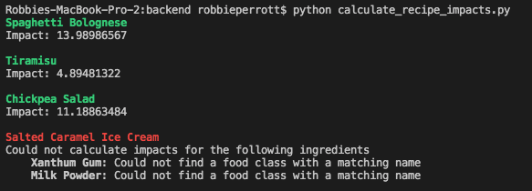
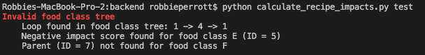
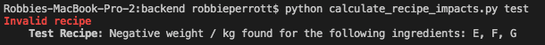

## Data Processing

### Running the code

Open a terminal window, go to the `fs-data-processing` folder and run the following command:

`python calculate_recipe_impacts.py`

You should then see a list of recipes, with impact scores for recipes where impacts were successfully calculated, and error messages for recipes whose impacts could not be calculated.

### Mypy

I used mypy for type checking. If you run `mypy .` you should see something like `Success: no issues found in 7 source files`.

### Testing

I have included some small test CSV files that I used to check the correctness of my code. To use these files rather than the given CSVs run:

`python calculate_recipe_impacts.py test`

The test files are located in `fs-data-processing/files/test/`. You can play around with the CSV data and check the results.

### CSV Data Validation

While playing around with the test CSVs, I noticed some edge cases that could cause problems, so I added a validation step in the beginning of the program to ensure that the incoming data is correct.

#### 1. Food Class Tree Validation

I included checks to ensure that there are no loops in the tree or invalid parent IDs. If there is a loop in the tree, or a parent ID that does not match a food class, then the entire tree is treated as invalid, and we do not proceed further.

If we were to continue on with loops in the tree, we could enter into an infinite loop while traversing the tree. We could also get incorrect impact scores. 

For example: say two food classes, A and B, both share a parent, C. And say that A is also the parent of C (i.e. there is a loop between A and C). Finally, assume that only A has an impact score. Then when we calculate the impact of B, we traverse the path B -> C -> A and end up with B having the same impact as A, which is incorrect.

While it may be possible to calculate impacts for some recipes even if there is an invalid parent ID somewhere, I chose not to allow this. This is because an invalid parent ID suggests that other data may be missing, outdated, or invalid.

If you run `python calculate_recipe_impacts.py test` with the original CSVs in `fs-data-processing/files/test/` you should see the results of the failed validation step in the console.

#### 2. Recipe Validation

I did not allow for negative impact scores. Similar to a missing parent ID, this may indicate corrupt data, so I chose to exit the program.

